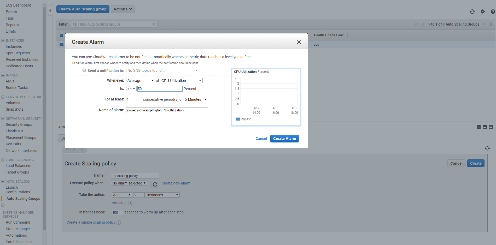

# Autoscaling mit AWS 
---
# Horizontale / vertikale Skalierung
- vertikal: mehr CPU/RAM
   - irgendwann ist Schluss
   - u.a. Overhead durch Kernel Context Switche 
- horizontal
   - viele, potenziell schwächere Maschinen
   - Anwendung muss damit umgehen können
---
# Herausforderungen bei horizontaler Skalierung (Applikationslayer)
- Persistente Daten dürfen nicht mehr lokal gespeichert werden
- Anwendung entweder stateless oder Speicherung der Session in Datenbank
- Datei-Upload nicht mehr lokal
  - S3
  - EFS
  - GlusterFS
  - ...
- Tasks soll(t)en über Queues verarbeitet werden und nicht lokal
---
# Horizontale Skalierung (PostgreSQL)
- Von Haus aus Replication von Master zu Slave möglich
- Skalierung erfolgt über Middleware
  - master/master durch PgCluster möglich - bisher noch nicht eingesetzt
- pgPool
  - Master-Slave Replication, Queries können ge-loadbalanct werden
  - Mehrere pgPooler teilen sich eine virtuelle IP
  - Je nach Anforderung komplexe Konfiguration vorhanden (Load Balancing, Failover etc.)
---
# Autoscaling mit AWS
- Autoscaling nur horizontal möglich
- Load Balancer (LB)
  - Verteilt eingehende Anfragen auf mehrere Backendsysteme
- Launch Configuration (LC)
  - Definiert AMI, Sicherheitsgruppen, Start-Script, Keypair usw.
- Autoscaling Group (ASG)
  - Nutzt eine LC
  - Minimale/maximale Anzahl Instanzen innerhalb der ASG
  - Zugeordnete Load Balancer
---
# Launch Configuration

---
# Autoscaling Group

---
# Wie wird skaliert?
- Scaling Policies
  - Wenn Wert X über Zeitraum Y mache Z
- Scheduled Actions
  - Zu Zeitpunkt X mache Z

---
# Scaling Policies

---
# Scheduled Action

---
# Wie bekomme ich meine App skaliert?
- Es gibt nicht "den einen" Weg - hängt vom bisherigen Projekt ab
 - CodeDeploy
 - Beanstalk
 - Prebaked AMI und AWS API
 - Configuration Management mit Chef oder Hosted Chef, Puppet oder Ansible
 - Deployment mit Spinnaker
 - ...

---
# Fragen?
- Entweder per Twitter an @schakko
- oder per E-Mail an christopher.klein@neos-it.de
