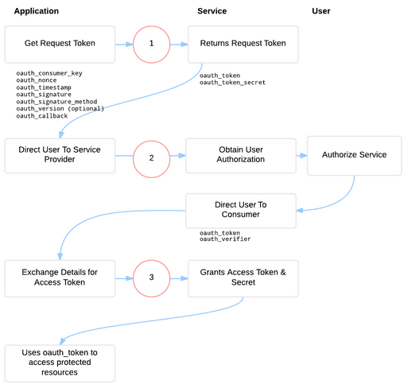

# OAuth 1.0a und OAuth 2
## Am Beispiel von Atlassian-Anwendungen

 
 
<small>Disclaimer: Dieser Talk behandelt das Thema nur oberflächlich.</small>

---
# Allgemein
- Standard zur Autorisierung von Zugriffen auf Ressourcen
- OAuth (seit 2006, veröffentlicht 2007)
 	- RFC-5849
- OAuth 2 (RFC veröffentlicht 2012)
	- RFC-6749
	- vereinfacht den Zugriff
	- Signierung fällt weg, Verantwortlichkeit liegt bei TLS
	- Scopes
	- Refresh Tokens

---
# Begriffe
|OAuth 1.0a|OAuth 2 (Rollen)|Beispiel|
|----|-----|---|
|User|Resource owner|Mein Jira-Account|
|Service Provider|Resource server|Jira|
|Consumer|Client|Meine App|
|---|Authorization Server|Jira, Crowd|
---
# Begriffe
|OAuth 1.0a|OAuth 2|Kontext|
|----|-----|---|
|Consumer Key und Secret|Client Id und Client Secret|Anwendung|
|Request Token und Secret|---|Benutzer|
|Access Token und Secret|Access Token|Session|
|---|Scope|Resource|

---
# OAuth 1.0a - 2-legged vs. 3-legged
- 3-legged beinhaltet Access Token und Secret
	- wird z. B. bei Web-Apps eingesetzt. Consumer Key/Secret hinterlegt der Betreiber der Web-App, Access Token und Secret der Benutzer der Web-App.
- 2-legged hat __kein__ Access Token und Secret
	- wird z. B. bei mobilen Twitter-Clients eingesetzt

---

# OAuth 1.0a - Workflow

<small>Siehe <a href="http://oauthbible.com/">http://oauthbible.com/</a></small>

---
# OAuth2 - Workflow

     +--------+                               +---------------+
     |        |--(A)- Authorization Request ->|   Resource    |
     |        |                               |     Owner     |
     |        |<-(B)-- Authorization Grant ---|               |
     |        |                               +---------------+
     |        |
     |        |                               +---------------+
     |        |--(C)-- Authorization Grant -->| Authorization |
     | Client |                               |     Server    |
     |        |<-(D)----- Access Token -------|               |
     |        |                               +---------------+
     |        |
     |        |                               +---------------+
     |        |--(E)----- Access Token ------>|    Resource   |
     |        |                               |     Server    |
     |        |<-(F)--- Protected Resource ---|               |
     +--------+                               +---------------+

<small>siehe <a href="https://tools.ietf.org/html/rfc6749">https://tools.ietf.org/html/rfc6749</a></small>

---

# Alles nicht so einfach

- OAuth 1.0a Workflow komplex
- Art und Weise der Datenübergabe abhängig vom Service Provider / Resource Server (Header, Query-Parameter)
- Workflow hängt vom Service Provider / Resource Server ab (Twitter)
- Spring: Konfiguration von OAuth 2 deutlich einfacher

---
# Beispiel
- Zugriff auf Atlassian-Dienste via OAuth 1.0a
	- OAuth2 (mit JWT) nur für Connect-Anwendungen :-/
- Atlassian bietet Beispielquellcode an
- jira-rest-client unterstützt nur Basic Auth

---
# getRequestToken

	public TokenSecretVerifierHolder getRequestToken() {
		// provider enth채lt u.a. consumerKey 
		// und consumerSecret und erzeugt den OAuthAccesor
		OAuthAccessor accessor = provider.getAccessor();
		OAuthClient oAuthClient = createOAuthClient();
		List<OAuth.Parameter> callBack;

		callBack = ImmutableList
            			.of(new OAuth.Parameter(OAuth.OAUTH_CALLBACK, provider.getCallback()));

		OAuthMessage message = oAuthClient.getRequestTokenResponse(accessor, "POST", callBack);

		TokenSecretVerifierHolder tokenSecretVerifier = new TokenSecretVerifierHolder(accessor.requestToken,
					accessor.tokenSecret, message.getParameter(OAUTH_VERIFIER));

		return tokenSecretVerifier;
	}
---

# swapRequestToken

	public String swapRequestTokenForAccessToken(String requestToken, String tokenSecret, String oauthVerifier) {
		OAuthAccessor accessor = provider.getAccessor();
		OAuthClient oAuthClient = createOAuthClient();
		accessor.requestToken = requestToken;
		accessor.tokenSecret = tokenSecret;
		OAuthMessage message = oAuthClient.getAccessToken(accessor, "POST",
					ImmutableList.of(new OAuth.Parameter(OAuth.OAUTH_VERIFIER, oauthVerifier)));

		return message.getToken();
	}
---

# makeAuthenticatedRequset

	public String makeAuthenticatedRequest(String url, String accessToken) {
		OAuthAccessor accessor = provider.getAccessor();
		OAuthClient oAuthClient = createOAuthClient();
		accessor.accessToken = accessToken;
		OAuthMessage response = oAuthClient.invoke(accessor, url, Collections.<Map.Entry<?, ?>>emptySet());

		return response.readBodyAsString();
	}
---

# Aufruf

	AtlassianOAuthProvider atlassianOAuthProvider = new AtlassianOAuthProvider(
    	"http://jira.atlassian.net",
		"my-consumer-key",
		"my-applications-private-key",
 		"http://localhost" /* or null */);

		AtlassianOAuthClient client = new AtlassianOAuthClient(atlassianOAuthProvider);
		TokenSecretVerifierHolder tokenSecretVerifierHolder = client.getRequestToken();

		// present user with the redirect
		System.out.println(
				"Go to " + atlassianOAuthProvider.getAuthorizeUrlForToken(tokenSecretVerifierHolder.getToken()));
		// after user has accepted, continue

		String accessToken = client.swapRequestTokenForAccessToken(tokenSecretVerifierHolder.getToken(),
				tokenSecretVerifierHolder.getSecret(), tokenSecretVerifierHolder.getVerifier());

		System.out.println("Storing your access token '" + accessToken
				+ "' in the database. Token is used for every request you are making to '"
				+ atlassianOAuthProvider.getBaseUrl() + "'");

---
# Fazit
- Wenn möglich, OAuth 2 einsetzen
- Workflow ausdrucken
- RFC lesen, Doku lesen
- Workflow ausdrucken